# BestoClinic — Mermaid Diagrams

> Companion to `TECHNICAL_REPORT.md`. Each diagram is numbered for cross-reference.
> Copy the fenced code blocks into any Mermaid renderer (mermaid.live, VS Code plugin, GitHub, etc.).

---

## Diagram 1: System Architecture

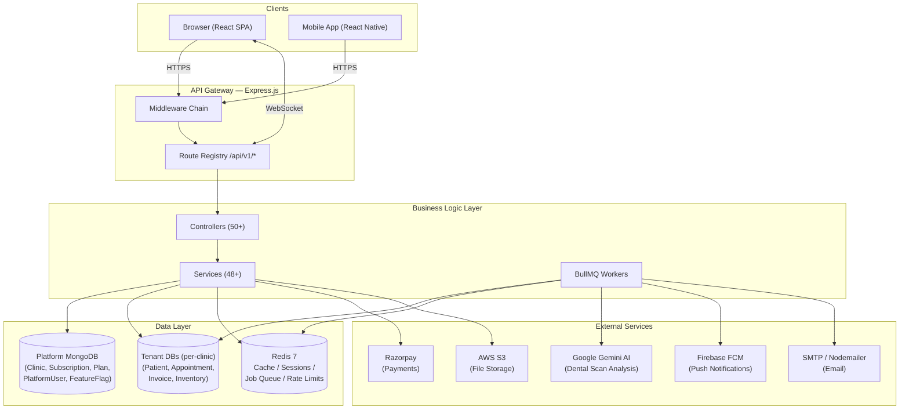
```mermaid
flowchart TD
    subgraph Clients
        Browser["Browser (React SPA)"]
        Mobile["Mobile App (React Native)"]
    end

    subgraph API_Gateway["API Gateway — Express.js"]
        MW["Middleware Chain"]
        Routes["Route Registry /api/v1/*"]
    end

    subgraph Business_Logic["Business Logic Layer"]
        Controllers["Controllers (50+)"]
        Services["Services (48+)"]
        Workers["BullMQ Workers"]
    end

    subgraph Data_Layer["Data Layer"]
        PlatformDB[("Platform MongoDB\n(Clinic, Subscription, Plan,\nPlatformUser, FeatureFlag)")]
        TenantDBs[("Tenant DBs (per-clinic)\n(Patient, Appointment,\nInvoice, Inventory)")]
        Redis[("Redis 7\nCache / Sessions /\nJob Queue / Rate Limits")]
    end

    subgraph External["External Services"]
        Razorpay["Razorpay\n(Payments)"]
        Gemini["Google Gemini AI\n(Dental Scan Analysis)"]
        Firebase["Firebase FCM\n(Push Notifications)"]
        SMTP["SMTP / Nodemailer\n(Email)"]
        S3["AWS S3\n(File Storage)"]
    end

    Browser -->|HTTPS| MW
    Mobile -->|HTTPS| MW
    Browser <-->|WebSocket| Routes
    MW --> Routes
    Routes --> Controllers
    Controllers --> Services
    Services --> PlatformDB
    Services --> TenantDBs
    Services --> Redis
    Workers --> TenantDBs
    Workers --> Redis
    Services --> Razorpay
    Workers --> Gemini
    Workers --> Firebase
    Workers --> SMTP
    Services --> S3
```

---

## Diagram 2: Component Interaction

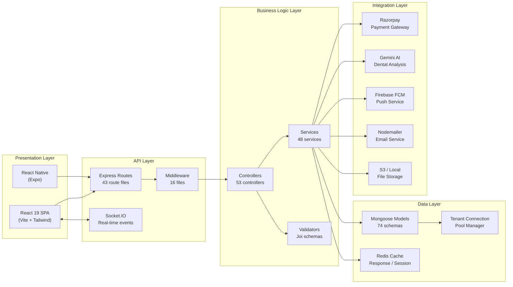
```mermaid
flowchart LR
    subgraph Presentation["Presentation Layer"]
        ReactSPA["React 19 SPA\n(Vite + Tailwind)"]
        MobileApp["React Native\n(Expo)"]
    end

    subgraph API_Layer["API Layer"]
        ExpressRoutes["Express Routes\n43 route files"]
        Middleware["Middleware\n16 files"]
        WebSocket["Socket.IO\nReal-time events"]
    end

    subgraph BL["Business Logic Layer"]
        Ctrl["Controllers\n53 controllers"]
        Svc["Services\n48 services"]
        Validators["Validators\nJoi schemas"]
    end

    subgraph DL["Data Layer"]
        Models["Mongoose Models\n74 schemas"]
        RedisCache["Redis Cache\nResponse / Session"]
        ConnPool["Tenant Connection\nPool Manager"]
    end

    subgraph IL["Integration Layer"]
        PaymentGW["Razorpay\nPayment Gateway"]
        AIEngine["Gemini AI\nDental Analysis"]
        PushSvc["Firebase FCM\nPush Service"]
        EmailSvc["Nodemailer\nEmail Service"]
        StorageSvc["S3 / Local\nFile Storage"]
    end

    ReactSPA --> ExpressRoutes
    MobileApp --> ExpressRoutes
    ReactSPA <--> WebSocket
    ExpressRoutes --> Middleware
    Middleware --> Ctrl
    Ctrl --> Validators
    Ctrl --> Svc
    Svc --> Models
    Svc --> RedisCache
    Models --> ConnPool
    Svc --> PaymentGW
    Svc --> AIEngine
    Svc --> PushSvc
    Svc --> EmailSvc
    Svc --> StorageSvc
```

---

## Diagram 3: Request Lifecycle

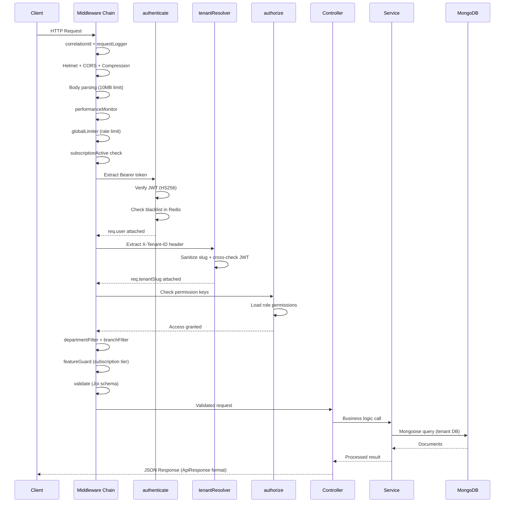
```mermaid
sequenceDiagram
    participant C as Client
    participant MW as Middleware Chain
    participant Auth as authenticate
    participant TR as tenantResolver
    participant Az as authorize
    participant Ctrl as Controller
    participant Svc as Service
    participant DB as MongoDB

    C->>MW: HTTP Request
    MW->>MW: correlationId + requestLogger
    MW->>MW: Helmet + CORS + Compression
    MW->>MW: Body parsing (10MB limit)
    MW->>MW: performanceMonitor
    MW->>MW: globalLimiter (rate limit)
    MW->>MW: subscriptionActive check
    MW->>Auth: Extract Bearer token
    Auth->>Auth: Verify JWT (HS256)
    Auth->>Auth: Check blacklist in Redis
    Auth-->>MW: req.user attached
    MW->>TR: Extract X-Tenant-ID header
    TR->>TR: Sanitize slug + cross-check JWT
    TR-->>MW: req.tenantSlug attached
    MW->>Az: Check permission keys
    Az->>Az: Load role permissions
    Az-->>MW: Access granted
    MW->>MW: departmentFilter + branchFilter
    MW->>MW: featureGuard (subscription tier)
    MW->>MW: validate (Joi schema)
    MW->>Ctrl: Validated request
    Ctrl->>Svc: Business logic call
    Svc->>DB: Mongoose query (tenant DB)
    DB-->>Svc: Documents
    Svc-->>Ctrl: Processed result
    Ctrl-->>C: JSON Response (ApiResponse format)
```

---

## Diagram 4: Authentication and Authorization Flow

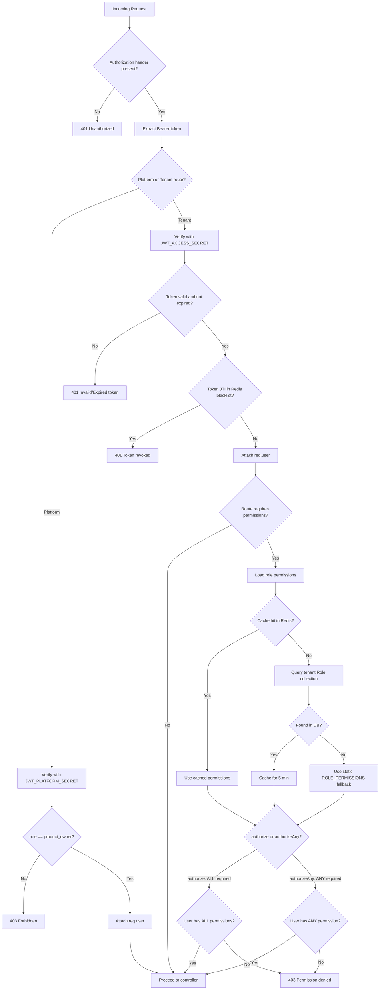
```mermaid
flowchart TD
    A[Incoming Request] --> B{Authorization header present?}
    B -->|No| C[401 Unauthorized]
    B -->|Yes| D[Extract Bearer token]
    D --> E{Platform or Tenant route?}
    E -->|Platform| F[Verify with JWT_PLATFORM_SECRET]
    E -->|Tenant| G[Verify with JWT_ACCESS_SECRET]
    F --> H{role == product_owner?}
    H -->|No| I[403 Forbidden]
    H -->|Yes| J[Attach req.user]
    G --> K{Token valid and not expired?}
    K -->|No| L[401 Invalid/Expired token]
    K -->|Yes| M{Token JTI in Redis blacklist?}
    M -->|Yes| N[401 Token revoked]
    M -->|No| O[Attach req.user]
    O --> P{Route requires permissions?}
    P -->|No| Q[Proceed to controller]
    P -->|Yes| R[Load role permissions]
    R --> S{Cache hit in Redis?}
    S -->|Yes| T[Use cached permissions]
    S -->|No| U[Query tenant Role collection]
    U --> V{Found in DB?}
    V -->|Yes| W[Cache for 5 min]
    V -->|No| X[Use static ROLE_PERMISSIONS fallback]
    T --> Y{authorize or authorizeAny?}
    W --> Y
    X --> Y
    Y -->|authorize: ALL required| Z{User has ALL permissions?}
    Y -->|authorizeAny: ANY required| AA{User has ANY permission?}
    Z -->|Yes| Q
    Z -->|No| AB[403 Permission denied]
    AA -->|Yes| Q
    AA -->|No| AB
    J --> Q
```

---

## Diagram 5: Multi-Tenancy Request Flow

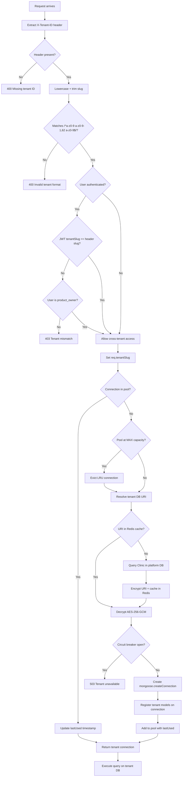
```mermaid
flowchart TD
    A[Request arrives] --> B[Extract X-Tenant-ID header]
    B --> C{Header present?}
    C -->|No| D[400 Missing tenant ID]
    C -->|Yes| E[Lowercase + trim slug]
    E --> F{Matches /^a-z0-9 a-z0-9- 1,62 a-z0-9$/?}
    F -->|No| G[400 Invalid tenant format]
    F -->|Yes| H{User authenticated?}
    H -->|Yes| I{JWT tenantSlug == header slug?}
    I -->|No| J{User is product_owner?}
    J -->|No| K[403 Tenant mismatch]
    J -->|Yes| L[Allow cross-tenant access]
    I -->|Yes| L
    H -->|No| L
    L --> M[Set req.tenantSlug]
    M --> N{Connection in pool?}
    N -->|Yes| O[Update lastUsed timestamp]
    N -->|No| P{Pool at MAX capacity?}
    P -->|Yes| Q[Evict LRU connection]
    P -->|No| R[Resolve tenant DB URI]
    Q --> R
    R --> S{URI in Redis cache?}
    S -->|Yes| T[Decrypt AES-256-GCM]
    S -->|No| U[Query Clinic in platform DB]
    U --> V[Encrypt URI + cache in Redis]
    V --> T
    T --> W{Circuit breaker open?}
    W -->|Yes| X[503 Tenant unavailable]
    W -->|No| Y[Create mongoose.createConnection]
    Y --> Z[Register tenant models on connection]
    Z --> AA[Add to pool with lastUsed]
    O --> BB[Return tenant connection]
    AA --> BB
    BB --> CC[Execute query on tenant DB]
```

---

## Diagram 6: Database Schema Relationships (ER Diagram)

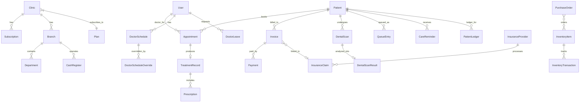
```mermaid
erDiagram
    Clinic ||--o{ Subscription : has
    Clinic ||--o{ Branch : has
    Clinic }|--|| Plan : subscribes_to
    Branch ||--o{ Department : contains

    User ||--o{ Appointment : "doctor_for"
    Patient ||--o{ Appointment : books
    Appointment ||--o| TreatmentRecord : produces
    TreatmentRecord ||--o{ Prescription : includes

    Patient ||--o{ Invoice : billed_to
    Invoice ||--o{ Payment : paid_by
    Invoice }o--o| InsuranceClaim : linked_to

    Patient ||--o{ DentalScan : undergoes
    DentalScan ||--o| DentalScanResult : analyzed_into

    User ||--o{ DoctorSchedule : has
    DoctorSchedule ||--o{ DoctorScheduleOverride : overridden_by
    User ||--o{ DoctorLeave : requests

    Patient ||--o{ QueueEntry : queued_as
    Patient ||--o{ CareReminder : receives

    InventoryItem ||--o{ InventoryTransaction : tracks
    PurchaseOrder }o--o{ InventoryItem : orders

    InsuranceProvider ||--o{ InsuranceClaim : processes

    Patient ||--o{ PatientLedger : ledger_for
    Branch ||--o{ CashRegister : operates
```

---

## Diagram 7: Appointment State Machine

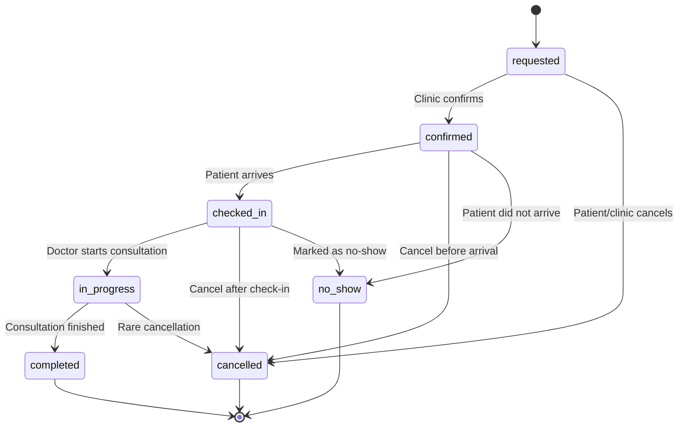
```mermaid
stateDiagram-v2
    [*] --> requested
    requested --> confirmed : Clinic confirms
    requested --> cancelled : Patient/clinic cancels

    confirmed --> checked_in : Patient arrives
    confirmed --> cancelled : Cancel before arrival
    confirmed --> no_show : Patient did not arrive

    checked_in --> in_progress : Doctor starts consultation
    checked_in --> cancelled : Cancel after check-in
    checked_in --> no_show : Marked as no-show

    in_progress --> completed : Consultation finished
    in_progress --> cancelled : Rare cancellation

    completed --> [*]
    cancelled --> [*]
    no_show --> [*]
```

---

## Diagram 8: Subscription Lifecycle

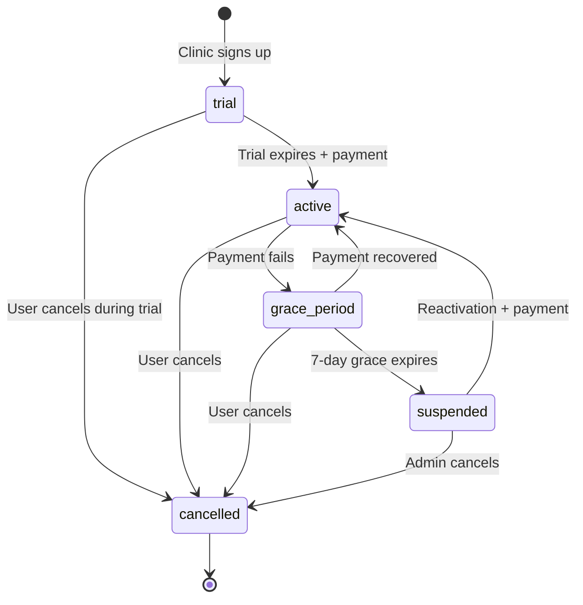
```mermaid
stateDiagram-v2
    [*] --> trial : Clinic signs up
    trial --> active : Trial expires + payment
    trial --> cancelled : User cancels during trial

    active --> grace_period : Payment fails
    active --> cancelled : User cancels

    grace_period --> active : Payment recovered
    grace_period --> suspended : 7-day grace expires
    grace_period --> cancelled : User cancels

    suspended --> active : Reactivation + payment
    suspended --> cancelled : Admin cancels

    cancelled --> [*]
```

---

## Diagram 9: Invoice Lifecycle

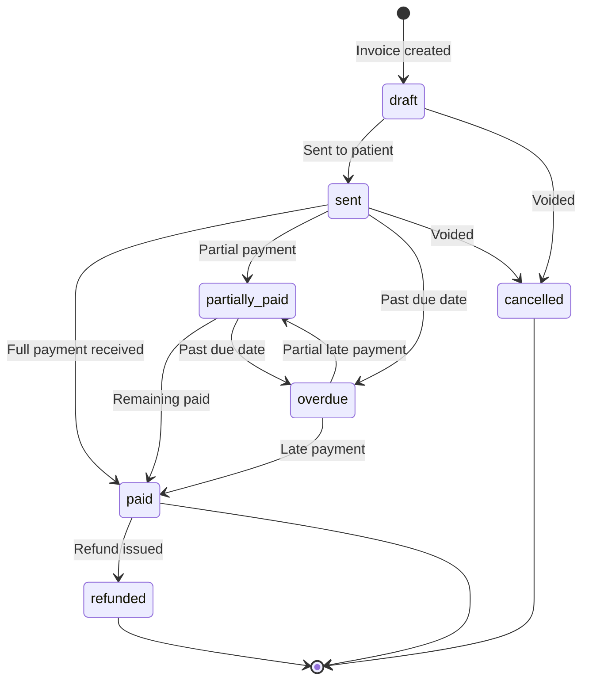
```mermaid
stateDiagram-v2
    [*] --> draft : Invoice created
    draft --> sent : Sent to patient
    draft --> cancelled : Voided

    sent --> paid : Full payment received
    sent --> partially_paid : Partial payment
    sent --> overdue : Past due date
    sent --> cancelled : Voided

    partially_paid --> paid : Remaining paid
    partially_paid --> overdue : Past due date

    overdue --> paid : Late payment
    overdue --> partially_paid : Partial late payment

    paid --> refunded : Refund issued

    cancelled --> [*]
    refunded --> [*]
    paid --> [*]
```

---

## Diagram 10: Insurance Claim Lifecycle

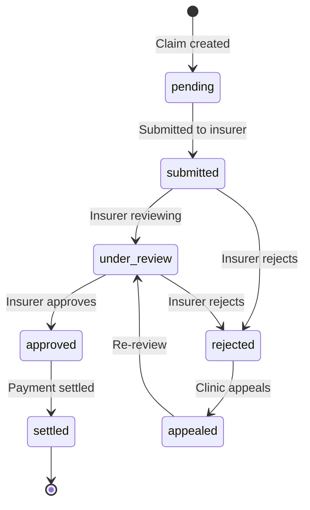
```mermaid
stateDiagram-v2
    [*] --> pending : Claim created
    pending --> submitted : Submitted to insurer

    submitted --> under_review : Insurer reviewing
    submitted --> rejected : Insurer rejects

    under_review --> approved : Insurer approves
    under_review --> rejected : Insurer rejects

    approved --> settled : Payment settled

    rejected --> appealed : Clinic appeals
    appealed --> under_review : Re-review

    settled --> [*]
```

---

## Diagram 11: Tenant Provisioning Flow

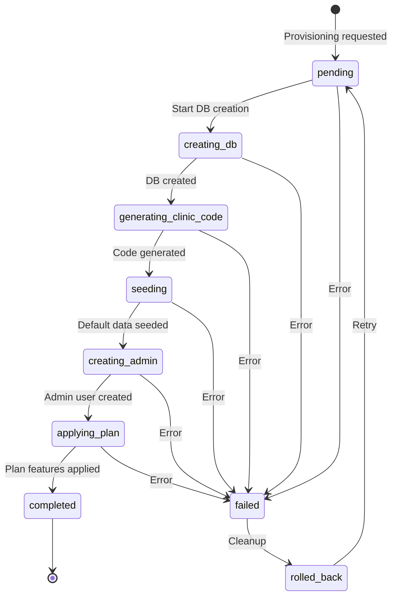
```mermaid
stateDiagram-v2
    [*] --> pending : Provisioning requested
    pending --> creating_db : Start DB creation
    creating_db --> generating_clinic_code : DB created
    generating_clinic_code --> seeding : Code generated
    seeding --> creating_admin : Default data seeded
    creating_admin --> applying_plan : Admin user created
    applying_plan --> completed : Plan features applied

    pending --> failed : Error
    creating_db --> failed : Error
    generating_clinic_code --> failed : Error
    seeding --> failed : Error
    creating_admin --> failed : Error
    applying_plan --> failed : Error

    failed --> rolled_back : Cleanup
    rolled_back --> pending : Retry

    completed --> [*]
```

---

## Diagram 12: Doctor Consultation Workflow

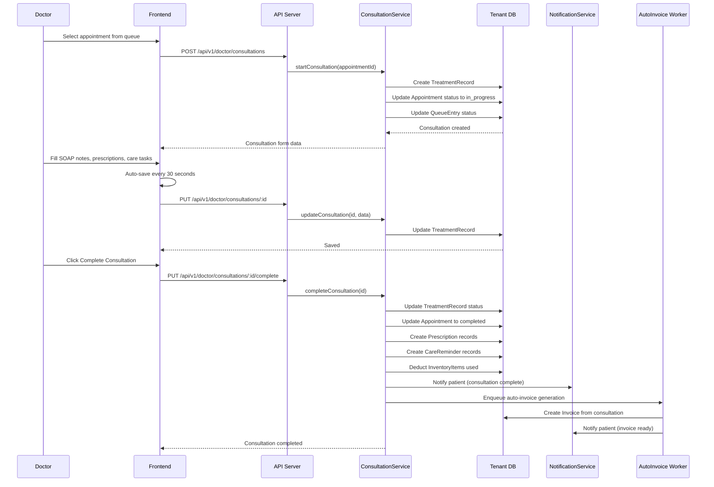
```mermaid
sequenceDiagram
    participant D as Doctor
    participant FE as Frontend
    participant API as API Server
    participant CS as ConsultationService
    participant DB as Tenant DB
    participant NS as NotificationService
    participant IW as AutoInvoice Worker

    D->>FE: Select appointment from queue
    FE->>API: POST /api/v1/doctor/consultations
    API->>CS: startConsultation(appointmentId)
    CS->>DB: Create TreatmentRecord
    CS->>DB: Update Appointment status to in_progress
    CS->>DB: Update QueueEntry status
    DB-->>CS: Consultation created
    CS-->>FE: Consultation form data

    D->>FE: Fill SOAP notes, prescriptions, care tasks
    FE->>FE: Auto-save every 30 seconds
    FE->>API: PUT /api/v1/doctor/consultations/:id
    API->>CS: updateConsultation(id, data)
    CS->>DB: Update TreatmentRecord
    DB-->>FE: Saved

    D->>FE: Click Complete Consultation
    FE->>API: PUT /api/v1/doctor/consultations/:id/complete
    API->>CS: completeConsultation(id)
    CS->>DB: Update TreatmentRecord status
    CS->>DB: Update Appointment to completed
    CS->>DB: Create Prescription records
    CS->>DB: Create CareReminder records
    CS->>DB: Deduct InventoryItems used
    CS->>NS: Notify patient (consultation complete)
    CS->>IW: Enqueue auto-invoice generation
    IW->>DB: Create Invoice from consultation
    IW->>NS: Notify patient (invoice ready)
    CS-->>FE: Consultation completed
```

---

## Diagram 13: Patient Booking Workflow

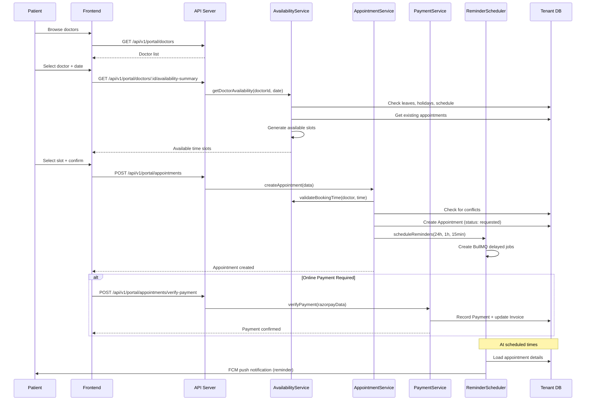
```mermaid
sequenceDiagram
    participant P as Patient
    participant FE as Frontend
    participant API as API Server
    participant AS as AvailabilityService
    participant ApS as AppointmentService
    participant PS as PaymentService
    participant RS as ReminderScheduler
    participant DB as Tenant DB

    P->>FE: Browse doctors
    FE->>API: GET /api/v1/portal/doctors
    API-->>FE: Doctor list

    P->>FE: Select doctor + date
    FE->>API: GET /api/v1/portal/doctors/:id/availability-summary
    API->>AS: getDoctorAvailability(doctorId, date)
    AS->>DB: Check leaves, holidays, schedule
    AS->>DB: Get existing appointments
    AS->>AS: Generate available slots
    AS-->>FE: Available time slots

    P->>FE: Select slot + confirm
    FE->>API: POST /api/v1/portal/appointments
    API->>ApS: createAppointment(data)
    ApS->>AS: validateBookingTime(doctor, time)
    ApS->>DB: Check for conflicts
    ApS->>DB: Create Appointment (status: requested)
    ApS->>RS: scheduleReminders(24h, 1h, 15min)
    RS->>RS: Create BullMQ delayed jobs
    ApS-->>FE: Appointment created

    alt Online Payment Required
        FE->>API: POST /api/v1/portal/appointments/verify-payment
        API->>PS: verifyPayment(razorpayData)
        PS->>DB: Record Payment + update Invoice
        PS-->>FE: Payment confirmed
    end

    Note over RS,DB: At scheduled times
    RS->>DB: Load appointment details
    RS->>P: FCM push notification (reminder)
```

---

## Diagram 14: Deployment Topology

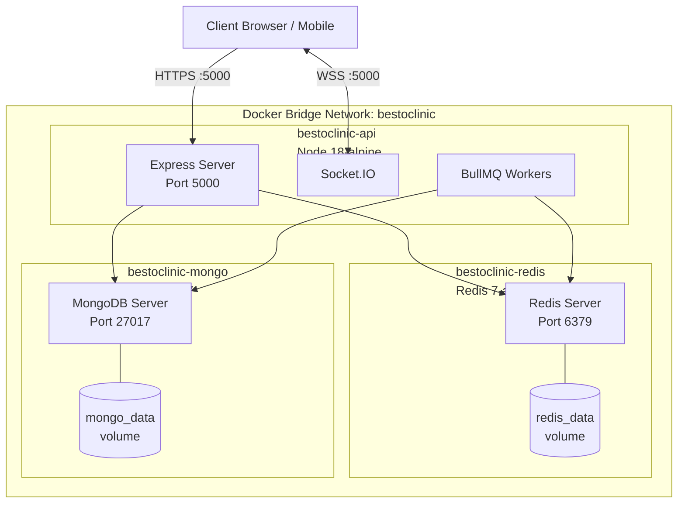
```mermaid
flowchart TD
    subgraph Docker_Network["Docker Bridge Network: bestoclinic"]
        subgraph API_Container["bestoclinic-api\nNode 18-alpine"]
            Express["Express Server\nPort 5000"]
            SocketIO["Socket.IO"]
            BullMQ["BullMQ Workers"]
        end

        subgraph Redis_Container["bestoclinic-redis\nRedis 7-alpine"]
            RedisServer["Redis Server\nPort 6379"]
            RedisVol[("redis_data\nvolume")]
        end

        subgraph Mongo_Container["bestoclinic-mongo\nMongoDB 7"]
            MongoServer["MongoDB Server\nPort 27017"]
            MongoVol[("mongo_data\nvolume")]
        end
    end

    Client["Client Browser / Mobile"] -->|HTTPS :5000| Express
    Client <-->|WSS :5000| SocketIO

    Express --> RedisServer
    BullMQ --> RedisServer
    Express --> MongoServer
    BullMQ --> MongoServer
    RedisServer --- RedisVol
    MongoServer --- MongoVol
```

---

## Diagram 15: Boot Sequence

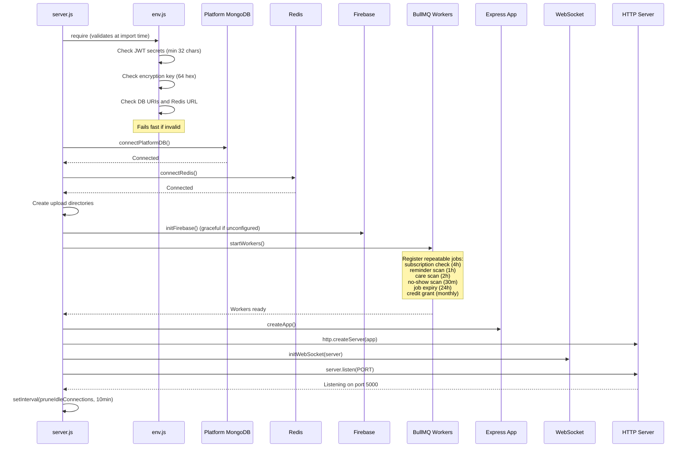
```mermaid
sequenceDiagram
    participant SJ as server.js
    participant ENV as env.js
    participant PDB as Platform MongoDB
    participant RD as Redis
    participant FB as Firebase
    participant BQ as BullMQ Workers
    participant APP as Express App
    participant WS as WebSocket
    participant HTTP as HTTP Server

    SJ->>ENV: require (validates at import time)
    ENV->>ENV: Check JWT secrets (min 32 chars)
    ENV->>ENV: Check encryption key (64 hex)
    ENV->>ENV: Check DB URIs and Redis URL
    Note over ENV: Fails fast if invalid

    SJ->>PDB: connectPlatformDB()
    PDB-->>SJ: Connected

    SJ->>RD: connectRedis()
    RD-->>SJ: Connected

    SJ->>SJ: Create upload directories
    SJ->>FB: initFirebase() (graceful if unconfigured)

    SJ->>BQ: startWorkers()
    Note over BQ: Register repeatable jobs:<br/>subscription check (4h)<br/>reminder scan (1h)<br/>care scan (2h)<br/>no-show scan (30m)<br/>job expiry (24h)<br/>credit grant (monthly)
    BQ-->>SJ: Workers ready

    SJ->>APP: createApp()
    SJ->>HTTP: http.createServer(app)
    SJ->>WS: initWebSocket(server)
    SJ->>HTTP: server.listen(PORT)
    HTTP-->>SJ: Listening on port 5000

    SJ->>SJ: setInterval(pruneIdleConnections, 10min)
```

---

## Diagram 16: Availability Calculation Algorithm

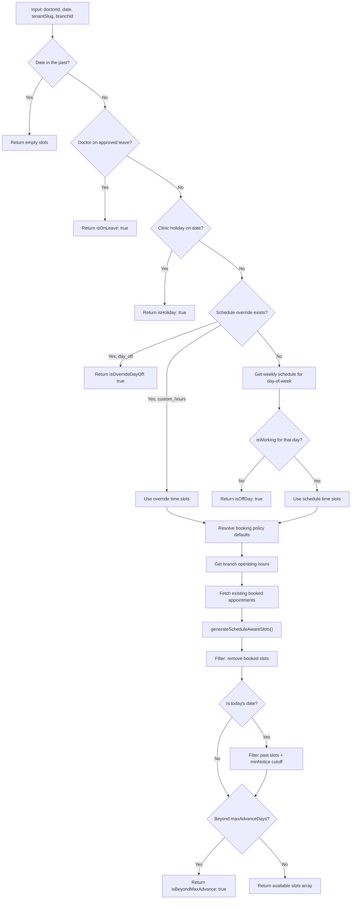
```mermaid
flowchart TD
    A["Input: doctorId, date, tenantSlug, branchId"] --> B{Date in the past?}
    B -->|Yes| C["Return empty slots"]
    B -->|No| D{Doctor on approved leave?}
    D -->|Yes| E["Return isOnLeave: true"]
    D -->|No| F{Clinic holiday on date?}
    F -->|Yes| G["Return isHoliday: true"]
    F -->|No| H{Schedule override exists?}
    H -->|Yes, day_off| I["Return isOverrideDayOff: true"]
    H -->|Yes, custom_hours| J["Use override time slots"]
    H -->|No| K["Get weekly schedule for day-of-week"]
    K --> L{isWorking for that day?}
    L -->|No| M["Return isOffDay: true"]
    L -->|Yes| N["Use schedule time slots"]
    J --> O["Resolve booking policy defaults"]
    N --> O
    O --> P["Get branch operating hours"]
    P --> Q["Fetch existing booked appointments"]
    Q --> R["generateScheduleAwareSlots()"]
    R --> S["Filter: remove booked slots"]
    S --> T{"Is today's date?"}
    T -->|Yes| U["Filter past slots + minNotice cutoff"]
    T -->|No| V{Beyond maxAdvanceDays?}
    U --> V
    V -->|Yes| W["Return isBeyondMaxAdvance: true"]
    V -->|No| X["Return available slots array"]
```

---

## Diagram 17: Dental Scan AI Pipeline

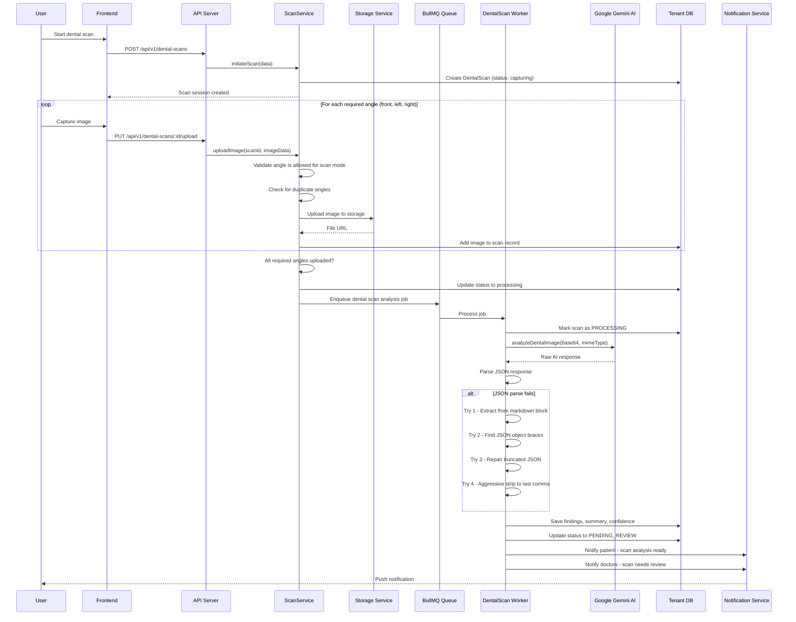
```mermaid
sequenceDiagram
    participant U as User
    participant FE as Frontend
    participant API as API Server
    participant SS as ScanService
    participant STO as Storage Service
    participant Q as BullMQ Queue
    participant W as DentalScan Worker
    participant AI as Google Gemini AI
    participant DB as Tenant DB
    participant NS as Notification Service

    U->>FE: Start dental scan
    FE->>API: POST /api/v1/dental-scans
    API->>SS: initiateScan(data)
    SS->>DB: Create DentalScan (status: capturing)
    SS-->>FE: Scan session created

    loop For each required angle (front, left, right)
        U->>FE: Capture image
        FE->>API: PUT /api/v1/dental-scans/:id/upload
        API->>SS: uploadImage(scanId, imageData)
        SS->>SS: Validate angle is allowed for scan mode
        SS->>SS: Check for duplicate angles
        SS->>STO: Upload image to storage
        STO-->>SS: File URL
        SS->>DB: Add image to scan record
    end

    SS->>SS: All required angles uploaded?
    SS->>DB: Update status to processing
    SS->>Q: Enqueue dental scan analysis job

    Q->>W: Process job
    W->>DB: Mark scan as PROCESSING
    W->>AI: analyzeDentalImage(base64, mimeType)
    AI-->>W: Raw AI response

    W->>W: Parse JSON response
    alt JSON parse fails
        W->>W: Try 1 - Extract from markdown block
        W->>W: Try 2 - Find JSON object braces
        W->>W: Try 3 - Repair truncated JSON
        W->>W: Try 4 - Aggressive strip to last comma
    end

    W->>DB: Save findings, summary, confidence
    W->>DB: Update status to PENDING_REVIEW
    W->>NS: Notify patient - scan analysis ready
    W->>NS: Notify doctors - scan needs review
    NS-->>U: Push notification
```

---

## Diagram 18: Permission Check Flow

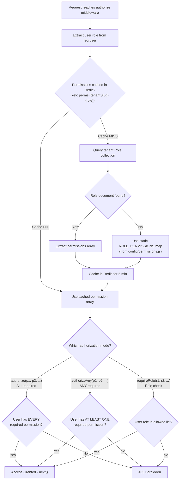
```mermaid
flowchart TD
    A["Request reaches authorize middleware"] --> B["Extract user role from req.user"]
    B --> C{"Permissions cached in Redis?\n(key: perms:{tenantSlug}:{role})"}
    C -->|Cache HIT| D["Use cached permission array"]
    C -->|Cache MISS| E["Query tenant Role collection"]
    E --> F{Role document found?}
    F -->|Yes| G["Extract permissions array"]
    F -->|No| H["Use static ROLE_PERMISSIONS map\n(from config/permissions.js)"]
    G --> I["Cache in Redis for 5 min"]
    H --> I
    I --> D

    D --> J{Which authorization mode?}

    J -->|"authorize(p1, p2, ...)\nALL required"| K{User has EVERY\nrequired permission?}
    J -->|"authorizeAny(p1, p2, ...)\nANY required"| L{User has AT LEAST ONE\nrequired permission?}
    J -->|"requireRole(r1, r2, ...)\nRole check"| M{User role in allowed list?}

    K -->|Yes| N["Access Granted - next()"]
    K -->|No| O["403 Forbidden"]
    L -->|Yes| N
    L -->|No| O
    M -->|Yes| N
    M -->|No| O
```
